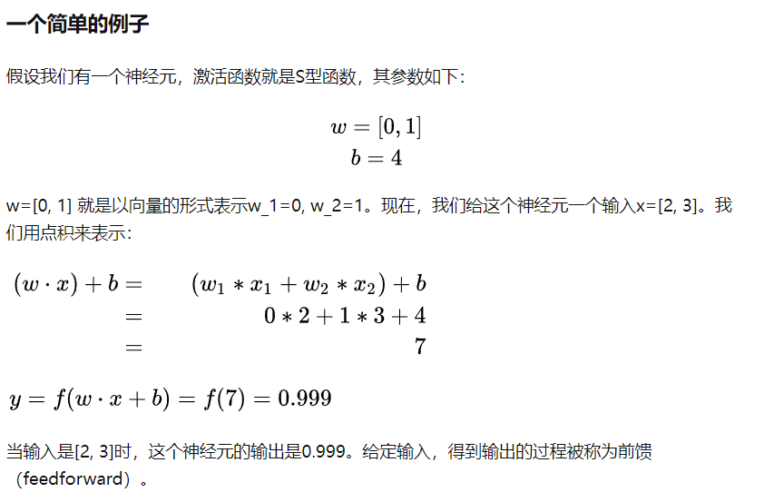
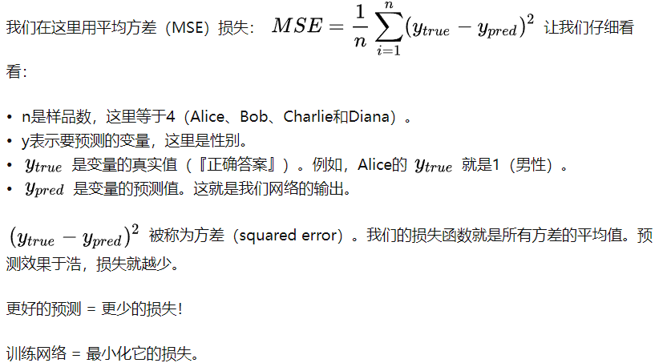
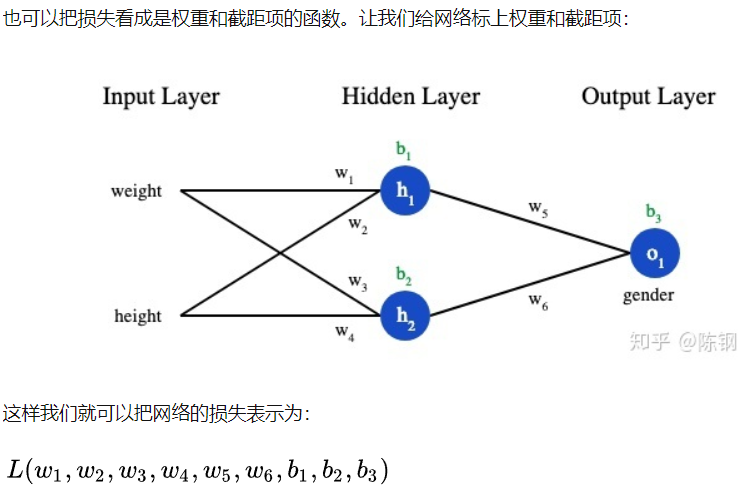

# Deep Learning Dictionary

Written by Yixiong Ding / YixiongDing@Gmail.com
June, 2022
_ _ _
## A
### Activation Function 激活函数
1. 激活函数的用途是将一个无边界的输入，转变成一个可预测的形式。
2. 最主要的作用是给神经元引入非线性因素，使得神经网络可以任意逼近任何非线性函数，这样神经网络就可以应用到众多的非线性模型中。

## B
### Back Propagation 反向传播算法

## F
### Feature Pyramid Network (FPN) 特征金字塔网络
1. 目标检测卷积结构类型
2. 
### Feedforward 前馈神经网络
1. 输入，经过加权，加上偏差，经过激活函数，输入在神经网络中向前传输，最终得到输出。这样的过程被称为前馈.

## L
### Learning Rate 学习率
1. 学习率是一个常数，存在于各种优化算法中，用于调整训练的速度。

### Loss Function 损失函数 
1. 量化网络结构的优良性，从而可以寻找更好的网络。
   
2. 也可以把损失看成是权重（weight）和截距项（bias）的函数。

## P

### Prymaid Network
1. 目标检测算法常用结构。
2. 通过将输入图像缩放到不同尺度的大小构成了图像金字塔。然后将这些不同尺度的特征输入到网络中（可以共享参数也可以独立参数）。
3. 得到每个尺度的检测结果，然后通过NMS等后处理手段进行预测结果的处理。
4. 图像金字塔最大的问题是推理速度慢了几倍，一个是因为要推理的图像数多了几倍，另一个原因是要检测小目标势必要放大图像。

## S 

### Stochastic Gradient Descent SGD 随机梯度下降
1. 网络优化算法，优化网络的权重和截距项，实现损失的最小化。

## T 

### Training Process 训练过程
对网络中的每个权重（weight）和截距项（bias）进行优化，损失就会不断下降，网络性能会不断上升。训练过程是这样的： 
1. 从数据集中选择一个样本，用随机梯度下降法进行优化 —— 每次都只针对一个样本进行优化； 
2. 计算每个权重或截距项对损失的偏导；
3. 用更新等式更新每个权重和截距项；
4. 在重复第一步；
