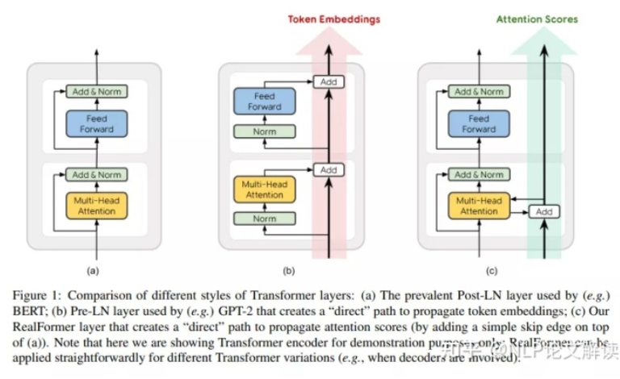

# Deep Learning Dictionary

Written by Yixiong Ding / YixiongDing@Gmail.com
June, 2022
_ _ _
## A
- ### Activation Function 激活函数
  1. 激活函数的用途是将一个无边界的输入，转变成一个可预测的形式。
  2. 最主要的作用是给神经元引入非线性因素，使得神经网络可以任意逼近任何非线性函数，这样神经网络就可以应用到众多的非线性模型中。

## B
- ### Back Propagation 反向传播算法
- ### Bias 偏差、截距项
  偏差是除了权重之外，另一个被应用于输入数据的线性分量。它被加到权重与输入数据相乘的结果中，用于改变权重与输入相乘所得结果的范围。
  

## D
- ### Degradation 网络退化
  在模型能够收敛的情况下，网络越深，模型的准确率越低，同时，模型的准确率先达到饱和，此后迅速下降。这个情况我们称之为网络退化（Degradation）

- ### Downstream Tasks 下游任务
  1. 在自监督学习（也用于NLP）的背景下，下游任务是你真正想要解决的任务。
  2. 特别是，在迁移学习（transfer learning）中，你首先用一些 "一般 "的数据集（例如ImageNet）对模型进行预训练，这些数据集并不代表你想要解决的任务，但允许模型学习一些 "一般 "特征。然后你在代表你想解决的实际问题的数据集上微调这个预训练的模型。在自监督学习的背景下，后一个任务/问题就是所谓的下游任务。
  3. 上游任务指对数据做预处理，如：分词、过滤、生成词向量等，上游任务的结果作为下游任务的输入。
  4. 下游任务是你在什么数据集上干的什么事，比如做分类任务，问答任务。

## E
- ### Exploding Gradient 梯度爆炸
  

## F
- ### Feature Pyramid Network (FPN) 特征金字塔网络
  1. 目标检测卷积结构类型

- ### Feedforward 前馈神经网络
  1. 输入，经过加权，加上偏差，经过激活函数，输入在神经网络中向前传输，最终得到输出。这样的过程被称为前馈.
   

## H
- ### Hyper Parameter 超参数
   超参数是我们控制我们模型结构、功能、效率等的调节旋钮，具体有：

  1. Learning Rate
  2. Epochs(迭代次数，也可称为 num of iterations)
  3. Num of Hidden Layers(隐层数目)
  4. Num of Hidden Layer Units(隐层的单元数/神经元数)
  5. Activation Function(激活函数)
  6. Batch-Size(用mini-batch SGD的时候每个批量的大小)
  7. Optimizer(选择什么优化器，如SGD、RMSProp、Adam)
  8. 用诸如RMSProp、Adam优化器的时候涉及到的β1，β2等等
   
   
   上面是一些最常见的超参数，一般的深度学习框架就是调节这些玩意儿。
   具体怎么调节，在不同的场景中基本都不同，没有统一的标准说learning rate取多少比较好、epochs多少比较好，都是在在实际情况中反复试验的。当然，如果我们可以借鉴一些知名的项目的超参数的选择，来应用到我们类似的项目中去。

## I
- ### Identity Mapping 恒等映射
  理想中的深网络，其表现不应该差于浅网络。举一个简单的例子，下图左边是2层的浅网络，右边是4层的深网络，我们只要令深网络的最后两层的输入输出相等，那么两个网络就是等效的，这种操作被称为恒等映射（Identity Mapping)。
  

  当然，这样完全相等的映射是一种极端情况，更为理想的情况是，在网络的深层，让网络尽量逼近这样的极端情况，使得网络在学到新东西的同时，其输出又能逼近输入，这样就能保证深网络的效果不会比浅网络更差。 总结：在网络的深层，需要学习一种恒等映射（Identity Mapping）。

## L
- ### Learning Rate 学习率
  1. 学习率是一个常数，存在于各种优化算法中，用于调整训练的速度。

- ### Long short-term memory（LSTM）
  1. 是一种特殊的RNN，主要是为了解决长序列训练过程中的梯度消失和梯度爆炸问题。简单来说，就是相比普通的RNN，LSTM能够在更长的序列中有更好的表现。

- ### Loss Function 损失函数 
  1. 量化网络结构的优良性，从而可以寻找更好的网络。
   
  2. 也可以把损失看成是权重（weight）和截距项（bias）的函数。
   

## O
- ### Operator 算子
   深度学习算法由一个个计算单元组成，我们称这些计算单元为算子（Operator，简称Op）。在网络模型中，算子对应层中的计算逻辑，例如：卷积层（Convolution Layer）是一个算子；全连接层（Fully-connected Layer， FC layer）中的权值求和过程，是一个算子。

## P

- ### Parameter 参数
   参数是我们训练神经网络 最终要学习的目标，最基本的就是神经网络的权重Weight和截距项bias，我们训练的目的，就是要找到一套好的模型参数，用于预测未知的结果。这些参数我们是不用调的，是模型来训练的过程中自动更新生成的。

- ### Prymaid Network
  1. 目标检测算法常用结构。
  2. 通过将输入图像缩放到不同尺度的大小构成了图像金字塔。然后将这些不同尺度的特征输入到网络中（可以共享参数也可以独立参数）。
  3. 得到每个尺度的检测结果，然后通过NMS等后处理手段进行预测结果的处理。
  4. 图像金字塔最大的问题是推理速度慢了几倍，一个是因为要推理的图像数多了几倍，另一个原因是要检测小目标势必要放大图像。

## R
- ## Residual 残差
  1. 因为存在网络退化问题，即在神经网络可以收敛的前提下，随着网络深度增加，网络的表现先是逐渐增加至饱和，然后迅速下降。总而言之，与浅层网络相比，更深的网络的表现不应该更差。因此，一个合理的猜测就是，对神经网络来说，恒等映射并不容易拟合。
  2. 
  3. 实验表明，残差网络很好地解决了深度神经网络的退化问题，并在ImageNet和CIFAR-10等图像任务上取得了非常好的结果，同等层数的前提下残差网络也收敛得更快。这使得前馈神经网络可以采用更深的设计。除此之外，去除个别神经网络层，残差网络的表现不会受到显著影响，这与传统的前馈神经网络大相径庭。
  4. 与图像领域不同的是，自然语言处理中的网络往往“宽而浅”，在这些网络中残差结构很难有用武之地。但是在谷歌提出了基于自注意力的Transformer架构，特别是BERT出现以后，自然语言处理也拥有了“窄而深”的网络结构，因此当然也可以充分利用残差连接，来达到优化网络的目的。事实上，Transformer本身就包含了残差连接，其中编码器和解码器中的每一个子模块都包含了残差连接，并使用了Layer Normalization。
  5. Transformer模型结构中每层都包含着残差结构，而残差结构中最原始的结构设计是Post-LN结构，即把Layer Norm (LN) 放在每个子层处理之后，如下图Figure 1(a)所示；而其他的一些预训练模型如GPT-2，则将LN改到每个子层处理之前，被定义为Pre-LN，如下图Figure 1(b)，有论文结果表明“Pre-LN”对梯度下降更加友好，收敛更快，更易于超参优化，但其性能总差于“Post-LN”。

## S 

- ### Stochastic Gradient Descent SGD 随机梯度下降
  1. 网络优化算法，优化网络的权重和截距项，实现损失的最小化。

## T 

- ### Tensor 张量
   Tensor是算子中的数据，包括输入数据与输出数据

- ### Training Process 训练过程
   对网络中的每个权重（weight）和截距项（bias）进行优化，损失就会不断下降，网络性能会不断上升。训练过程是这样的： 
  1. 从数据集中选择一个样本，用随机梯度下降法进行优化 —— 每次都只针对一个样本进行优化； 
  2. 计算每个权重或截距项对损失的偏导；
  3. 用更新等式更新每个权重和截距项；
  4. 在重复第一步；

## V
- ### Vanishing Gradient 梯度消失

## W
- ### Weight 权重
  当输入数据进入计算单元时，会乘以一个权重。例如，如果一个算子有两个输入，则每个输入会分配一个关联权重，一般将认为较重要数据赋予较高的权重，不重要的数据赋予较小的权重，为零的权重则表示特定的特征是无需关注的。
  